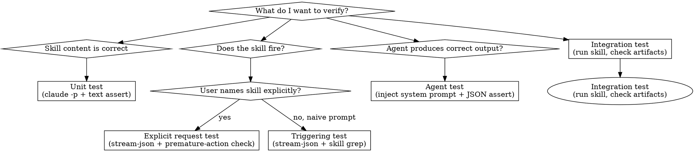

# Prompt Testing

## When This Skill is Invoked

When given a skill or agent name, write test files — don't explain theory.

### Step 1: Scaffold (run the script)

**Single component:**
```bash
bash skills/prompt-testing/scaffold-test.sh skill <skill-name>
bash skills/prompt-testing/scaffold-test.sh agent <agent-name>
```

**Whole repo (scan for gaps, prioritized by recency):**
```bash
bash skills/prompt-testing/scan-and-scaffold.sh            # scaffold all untested
bash skills/prompt-testing/scan-and-scaffold.sh --dry-run  # preview gaps only
bash skills/prompt-testing/scan-and-scaffold.sh --skills   # skills only
bash skills/prompt-testing/scan-and-scaffold.sh --agents   # agents only
```

Both generate:
- `test/skills/test-<name>.sh` (or `test/agents/`) with placeholder tests
- `test/skills/test-helpers.sh` if not present

### Step 2: Fill in assertions

1. Read the target skill's SKILL.md (or agent's `.md`)
2. Extract 6–10 behavioral claims — things the skill says it does, requires, or produces
3. For each claim, replace a placeholder with a `run_claude` unit test
4. Replace triggering placeholders with real natural language prompts

**Prompt pattern (unit test):**
```
"In the <skill-name> skill, what is <specific behavior>?"
"Does the <skill-name> skill require <X>? What should <Y> do?"
"What happens in <skill-name> when <scenario>?"
```
This is the canonical pattern — see the gold standard reference below.

---

## Overview

Claude Code skills and agents are tested by running `claude -p` in headless mode and asserting on the output. There are four test types — using the wrong one is the most common mistake.

**Core principles:**
1. Never use self-reported JSON (`{"invoke": true}`) to test triggering. Claude says "yes" even when the Skill tool wouldn't actually fire. Only `--output-format stream-json` tells you what actually happened.
2. Always use `--model haiku` for prompt tests. Triggering tests only verify tool dispatch, not output quality — haiku is ~60x cheaper than Opus and sufficient. Expose via `TEST_MODEL` env var for override.
3. **Triggering test prompts must be natural language. Never include the skill name.** `"use the briefing skill"` always triggers — it tests nothing. `"what happened this week?"` is a real test. This is the most common failure mode.

---

## 🔍 The Four Test Types



| Type | Mechanism | Speed | Use when |
|------|-----------|-------|----------|
| **Unit** | `claude -p "question"` + text grep | 30–60s | Verifying skill content says the right things |
| **Agent** | inject system prompt + JSON assertions | 60–120s | Verifying agent output schema and correctness |
| **Triggering** | `stream-json` + `"name":"Skill"` grep | 60–180s | Verifying a naive prompt fires the right skill |
| **Explicit request** | `stream-json` + premature-action check | 60–180s | Verifying named invocation fires + no work before load |
| **Integration** | Run full skill, check artifacts | 10–30min | End-to-end workflow verification |

---

## 📋 File Structure

```
tests/
  agents/
    test-helpers.sh          ← shared assertion library
    run-tests.sh             ← test runner
    test-<agent-name>.sh     ← one file per agent
  skills/
    test-helpers.sh          ← shared helpers (stream-json version)
    run-tests.sh
    test-<skill-name>.sh     ← one file per skill
```

Always check if `test-helpers.sh` already exists before writing new helpers — follow the established pattern.

---

## 🧪 Type 1: Unit Test

Tests that the skill document contains the right content and teaches the right behavior.

```bash
source ./test-helpers.sh

output=$(run_claude "In the review skill, what round count is used for a 50-line file?")

assert_contains "$output" "2 rounds\|two rounds" "50-line file → 2 rounds"
assert_contains "$output" "50.*199\|50-199" "references the correct range"
```

`run_claude` is `claude -p "$prompt" --model "$TEST_MODEL" --output-format text`.

---

## 🧪 Type 2: Agent Test

Tests that an agent produces correct structured output for a given scenario. Inject the system prompt inline — do NOT rely on the plugin being loaded.

```bash
source ./test-helpers.sh

# run_as_agent strips frontmatter and injects system prompt + scenario
output=$(run_as_agent "judge.md" "
Round 1. No prior rulings.
<code>...</code>
<findings>...</findings>
<verdicts>...</verdicts>
Respond with only the JSON ruling object.
" 90)

assert_json_field "$output" "convergence" "False" "convergence=false on round 1"
assert_json_has_key "$output" "rulings" "rulings key present"
assert_json_array_length "$output" "rulings" "1" "one ruling per finding"
```

`run_as_agent` uses awk to strip YAML frontmatter, then calls `claude -p "system_prompt\n\n---\n\nscenario"`.

**Never use self-report JSON** (`{"would_you_trigger": true}`) — Claude answers based on what sounds correct, not what the Skill tool would actually do.

---

## 🔍 Type 3: Triggering Test

Tests that a natural user prompt causes the correct skill to fire. Requires `--output-format stream-json` — this is the only reliable mechanism.

```bash
PLUGIN_DIR="/path/to/plugin"
SKILL_NAME="review"
PROMPT="run a review round on my code"

LOG=$(mktemp)
claude -p "$PROMPT" \
    --model "$TEST_MODEL" \
    --plugin-dir "$PLUGIN_DIR" \
    --dangerously-skip-permissions \
    --max-turns 3 \
    --verbose \
    --output-format stream-json \
    > "$LOG" 2>&1

# Check skill fired
SKILL_PATTERN='"skill":"([^"]*:)?'"${SKILL_NAME}"'"'
if grep -q '"name":"Skill"' "$LOG" && grep -qE "$SKILL_PATTERN" "$LOG"; then
    echo "  [PASS] skill triggered"
else
    echo "  [FAIL] skill NOT triggered"
    echo "  Skills that fired: $(grep -o '"skill":"[^"]*"' "$LOG" | sort -u)"
fi
```

**Why stream-json**: The JSONL output captures every tool invocation. `"name":"Skill"` appears when the Skill tool is called. The `skill` field contains the skill name. Text output alone cannot tell you whether the Skill tool fired.

**Negative tests matter**: Also test prompts that should NOT trigger the skill (`run the test suite`, `start the grind loop`) to verify the skill isn't over-eager.

### ⚠️ Cheat Mode vs Natural Language

The hardest part of a triggering test is writing prompts that actually test routing. Cheat mode prompts always pass — they prove nothing.

| Mode | Example | Problem |
|------|---------|---------|
| ❌ Cheat mode | `"use the briefing skill"` | Skill name in prompt — always fires |
| ❌ Cheat mode | `"invoke adversarial-review"` | Explicit invocation — always fires |
| ❌ Cheat mode | `"run the idea-matrix skill"` | Same |
| ✅ Natural language | `"what happened this week?"` | Tests real routing from user intent |
| ✅ Natural language | `"check my code for issues"` | Tests real routing from user intent |
| ✅ Natural language | `"which design option is better?"` | Tests real routing from user intent |

**Rule:** The prompt must be something a user would type without knowing the skill exists. If the skill name or any of its trigger keywords appear in the prompt, the test is cheat mode.

**Source real prompts from actual usage.** Search `lcm grep` or `git log` for how the user actually invoked the skill. Real session history beats invented examples.

---

## ✅ Type 4: Explicit Request Test

Tests that when a user names the skill directly, it fires AND no work happens before it loads. The premature-action check is the critical addition over a regular triggering test.

```bash
PROMPT="review, please"  # or "use the review skill", "review skill, please"

LOG=$(mktemp)
claude -p "$PROMPT" \
    --model "$TEST_MODEL" \
    --plugin-dir "$PLUGIN_DIR" \
    --dangerously-skip-permissions \
    --max-turns 3 \
    --verbose \
    --output-format stream-json \
    > "$LOG" 2>&1

# 1. Skill fired
if grep -q '"name":"Skill"' "$LOG" && grep -qE "$SKILL_PATTERN" "$LOG"; then
    echo "  [PASS] skill triggered"
else
    echo "  [FAIL] skill NOT triggered"; exit 1
fi

# 2. No premature work before skill load (the critical check)
FIRST_SKILL_LINE=$(grep -n '"name":"Skill"' "$LOG" | head -1 | cut -d: -f1)
PREMATURE=$(head -n "$FIRST_SKILL_LINE" "$LOG" | \
    grep '"type":"tool_use"' | \
    grep -v '"name":"Skill"' | \
    grep -v '"name":"TodoWrite"')

if [ -n "$PREMATURE" ]; then
    echo "  [FAIL] work happened BEFORE skill loaded:"
    echo "$PREMATURE" | head -3
else
    echo "  [PASS] no premature tool use"
fi
```

**Why premature-action detection matters**: The failure mode is Claude starts reading files or writing code before loading the skill. By the time it loads, it has already bypassed the skill's workflow instructions.

---

## 📋 Test Organization for Triggering Tests

Organize triggering tests into sections by prompt source and intent. This structure catches both known regressions and extrapolated edge cases:

| Section | Purpose | Example prompts |
|---------|---------|-----------------|
| **Real user queries** | Actual prompts from session history (lcm grep, git log) | "what do we have wip?", "what did we do last session?" |
| **Orientation variants** | Same intent, different wording — extrapolate from real patterns | "sitrep", "bring me up to speed", "fill me in" |
| **Continuation** | User resuming prior work | "pick up where we left off", "where were we?" |
| **Implementation context** | User needs prior decisions before starting work | "any decisions about the migration?" |
| **Terse/shorthand** | Power-user minimal prompts | "wip?", "status?", "updates?" |
| **Negatives** | Must NOT trigger — general knowledge, simple code gen | "what is a binary search tree?", "hello world in python" |
| **Explicit request** | Named invocation + premature-work check | "/skill-name", "use the X skill" |

**Source real test cases from actual usage.** Search lcm/git for the user's actual session-start messages. Extrapolate common wording patterns from those — don't invent test cases in a vacuum.

---

## ❌ Common Mistakes

| Mistake | Why it fails | Fix |
|---------|-------------|-----|
| `"use the X skill"` as a triggering prompt | Cheat mode — skill name in prompt guarantees a match, tests nothing | Use natural language without skill names: `"what happened this week?"` not `"use briefing"` |
| `{"would_trigger": true}` for triggering tests | Claude self-reports based on reasoning, not actual tool dispatch | Use `--output-format stream-json` + `"name":"Skill"` grep |
| Missing `--plugin-dir` | Claude Code loads user's installed plugins, not the dev version | Always pass `--plugin-dir` for triggering/explicit tests |
| Missing `--dangerously-skip-permissions` | Claude Code prompts for permission confirmation in headless mode | Required for non-interactive test runs |
| Omitting `--output-format stream-json` | Text output has no record of which tools fired | Required for all triggering tests |
| Missing `--verbose` with `stream-json` | `--output-format stream-json` requires `--verbose` in print mode — silently produces empty output without it | Always pair `--verbose` with `--output-format stream-json` |
| Using `timeout` on macOS | GNU `timeout` is not available by default on macOS | Remove `timeout` or use Bash `SECONDS`-based guard; don't depend on coreutils |
| Using `set -e` in test runner | First failure kills the entire suite — you lose visibility into subsequent tests | Use `set -uo pipefail` without `-e`; collect results via `record()` |
| Skipping negative tests | Skill might trigger on everything | Test prompts that should NOT trigger |
| One giant test file | Slow and hard to debug | One test file per agent/skill |

---

## 📋 Quick Reference: Invocation Flags

```bash
# Unit / agent tests (no plugin loading needed)
claude -p "$PROMPT" --model "$TEST_MODEL" --output-format text

# Triggering / explicit request tests
claude -p "$PROMPT" \
    --model "$TEST_MODEL" \
    --plugin-dir "$PLUGIN_DIR" \
    --dangerously-skip-permissions \
    --max-turns 3 \
    --verbose \
    --output-format stream-json
```

`--max-turns 3` is enough for triggering tests — you only need to verify the skill fires, not complete the workflow.

`--model haiku` keeps costs low — triggering tests check tool dispatch, not output quality. Override with `TEST_MODEL=sonnet` when debugging failures.

---

## 📋 test-helpers.sh — Inline Reference

The scaffold script writes this file automatically. Inline copy for reference when writing assertions:

```bash
#!/usr/bin/env bash
# Cross-platform (macOS + Linux) — no GNU timeout dependency.
TEST_MODEL="${TEST_MODEL:-haiku}"
PLUGIN_DIR="${PLUGIN_DIR:-$(cd "$(dirname "$0")/../.." && pwd)}"

run_claude() {
    local prompt="$1"; local max_turns="${2:-3}"
    claude -p "$prompt" --model "$TEST_MODEL" --output-format text --max-turns "$max_turns" 2>/dev/null
}

run_with_plugin() {
    local prompt="$1"; local max_turns="${2:-3}"; local log; log=$(mktemp)
    claude -p "$prompt" --model "$TEST_MODEL" --plugin-dir "$PLUGIN_DIR" \
        --dangerously-skip-permissions --max-turns "$max_turns" \
        --verbose --output-format stream-json > "$log" 2>&1
    echo "$log"
}

assert_contains() {
    local output="$1"; local pattern="$2"; local name="${3:-test}"
    if echo "$output" | grep -qiE "$pattern"; then echo "  [PASS] $name"; return 0
    else echo "  [FAIL] $name — expected: $pattern"; echo "$output" | head -3; return 1; fi
}

assert_not_contains() {
    local output="$1"; local pattern="$2"; local name="${3:-test}"
    if echo "$output" | grep -qiE "$pattern"; then echo "  [FAIL] $name — found: $pattern"; return 1
    else echo "  [PASS] $name"; return 0; fi
}

assert_order() {
    local output="$1"; local a="$2"; local b="$3"; local name="${4:-order}"
    local la lb
    la=$(echo "$output" | grep -niE "$a" | head -1 | cut -d: -f1)
    lb=$(echo "$output" | grep -niE "$b" | head -1 | cut -d: -f1)
    if [ -n "$la" ] && [ -n "$lb" ] && [ "$la" -lt "$lb" ]; then echo "  [PASS] $name"; return 0
    else echo "  [FAIL] $name — '$a'(L$la) not before '$b'(L$lb)"; return 1; fi
}

assert_skill_triggered() {
    local log="$1"; local skill="$2"; local name="${3:-skill triggered}"
    if grep -q '"name":"Skill"' "$log" && grep -qE '"skill":"([^"]*:)?'"$skill"'"' "$log"; then
        echo "  [PASS] $name"; return 0
    else echo "  [FAIL] $name — skills fired: $(grep -o '"skill":"[^"]*"' "$log" | sort -u)"; return 1; fi
}

assert_no_premature_work() {
    local log="$1"; local name="${2:-no premature work}"
    local first; first=$(grep -n '"name":"Skill"' "$log" | head -1 | cut -d: -f1)
    [ -z "$first" ] && echo "  [FAIL] $name (skill never called)" && return 1
    local pre; pre=$(head -n "$first" "$log" | grep '"type":"tool_use"' | grep -v '"name":"Skill"' | grep -v '"name":"TodoWrite"')
    if [ -n "$pre" ]; then echo "  [FAIL] $name — premature: $(echo "$pre" | head -1)"; return 1
    else echo "  [PASS] $name"; return 0; fi
}

PASS=0; FAIL=0
record() { if [ "$1" -eq 0 ]; then PASS=$((PASS+1)); else FAIL=$((FAIL+1)); fi; }
summary() { echo ""; echo "Results: $PASS passed, $FAIL failed"; [ "$FAIL" -eq 0 ]; }
```

---

## 📝 Real Examples — Gold Standard

**Unit test gold standard** — read this before writing any tests:

`~/.claude/plugins/cache/claude-plugins-official/superpowers/5.0.7/tests/claude-code/test-subagent-driven-development.sh`

This is the reference implementation. Every test follows the same pattern:
```bash
output=$(run_claude "In the subagent-driven-development skill, what comes first: spec compliance review or code quality review?" 30)
assert_contains "$output" "spec.*compliance" "Spec compliance before code quality"
```

Key qualities to match:
- Prompts are natural language questions about skill content — never `"use the skill"` or `"invoke"`
- Each test verifies one specific behavioral claim from the skill doc
- 6–10 tests per skill, one claim per test
- Tests use `assert_contains`, `assert_not_contains`, `assert_order` — no complex logic

**Helpers reference:**
`~/.claude/plugins/cache/claude-plugins-official/superpowers/5.0.7/tests/claude-code/test-helpers.sh`

For autoimprove agents specifically:
- `test/agents/test-judge.sh` — Type 2: JSON assertions on judge output
- `test/agents/test-enthusiast.sh` — Type 2: schema, severity, sequential IDs
- `test/agents/test-adversary.sh` — Type 2: verdict coverage

---

## 🔍 Debugging Failing Tests

### ❌ Triggering test fails: skill never fires

1. **Confirm the skill is loaded.** Dump all skills that fired during the test run:
   ```bash
   grep -o '"skill":"[^"]*"' "$LOG" | sort -u
   ```
   If the list is empty, the plugin directory is wrong or the skill has a syntax error in its frontmatter.

2. **Check the plugin is visible.** Run `claude --list-skills --plugin-dir "$PLUGIN_DIR"` to confirm the skill appears. If it doesn't, the `.claude-plugin/plugin.json` or the SKILL.md frontmatter is malformed.

3. **Check the description trigger text.** The skill fires based on its `description:` field in SKILL.md frontmatter. If the test prompt doesn't match the description's trigger examples, the LLM won't route to it. Add a trigger phrase that matches the test prompt.

4. **Try with a stronger model.** Haiku may not route correctly for ambiguous triggers. Run once with `TEST_MODEL=sonnet` to confirm the routing logic works before debugging the description.

5. **Inspect the full JSONL log.** The stream-json log captures every LLM decision — look for the assistant message before the failed Skill call to see what it reasoned:
   ```bash
   grep '"type":"assistant"' "$LOG" | head -3 | jq -r '.message.content[0].text // empty'
   ```

### ❌ Agent test fails: JSON assertion mismatch

1. **Print the raw output** before asserting:
   ```bash
   echo "RAW: $output"
   ```
   The most common cause is the agent produced a non-JSON preamble ("Sure, here is my verdict:") before the JSON block. Use `extract_json` from `test-helpers.sh` to strip it.

2. **Check frontmatter stripping.** `run_as_agent` strips YAML frontmatter with awk. If the agent file uses `---` inside the body (e.g., a markdown separator), awk may strip too much. Inspect what the helper actually sends as the system prompt.

3. **Verify the scenario is valid.** Agent tests inject a scenario as the user message. If the scenario is under-specified, the agent may produce valid JSON with different field values than expected. Make the scenario concrete enough to force a deterministic output.

### ❌ Test passes locally but fails in CI

- **Missing env vars.** `TEST_MODEL`, `PLUGIN_DIR`, and `ANTHROPIC_API_KEY` must be set. CI may not inherit your shell's env.
- **macOS vs Linux.** `grep -E` behavior and `awk` field separators differ. Test on both if possible; prefer POSIX constructs.
- **Flaky haiku routing.** Haiku's skill dispatch can be non-deterministic on borderline prompts. If a test is <80% reliable, either strengthen the trigger description or move the test to sonnet.

---

## 📋 When NOT to Use This Skill

- **Running tests** — use the `/autoimprove test` skill to execute existing test suites
- **Testing business logic, utilities, or regular application code** — this skill covers plugin components (skills, agents, commands) only; use your project's standard test framework for everything else
- **Benchmarking output quality** — the challenge skill measures agent accuracy with F1 scoring; prompt-testing checks behavioral correctness, not metric performance
- **Debugging a failing skill at runtime** — check `autoimprove status` and `autoimprove report` first; prompt-testing is for writing new tests, not diagnosing live session issues
